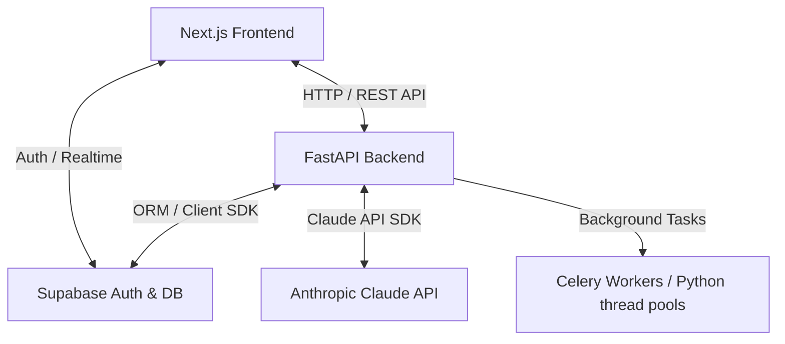

# Kozker Recruiter AI

Kozker Recruiter AI is an enterprise-grade, data-dense, AI-powered internal recruitment management platform. It automates and streamlines the full hiring lifecycle—from client mandate registration and AI-generated job openings, to candidate resume parsing, intelligent fuzzy-score matching, personalized screening question generation, and candidate pipeline tracking.

---

## 🛠️ Architecture & Tech Stack

The platform is split into a **Next.js frontend** and a **FastAPI backend**, utilizing **Supabase** for database, authentication, and file storage.

### Technology Blueprint



### 1. Frontend (`/frontend`)
*   **Framework**: Next.js 14 (App Router) with React 18
*   **Language**: TypeScript 5.x for robust, compile-time safety
*   **Styling**: Tailwind CSS 3.x following the [DESIGN.md](file:///home/aderham/Kozkerprojs/Kozker_recruiter_AI/Kozker_recruiter_AI/DESIGN.md) specification (Brand Orange `#FF6E30`, sharp corners, data-dense layouts, minimal rounded borders)
*   **Component Library**: shadcn/ui (Radix UI primitives) and Lucide React icons
*   **Uploader Integration**: PapaParse (CSV processing) and custom PDF/DOCX previewers
*   **API Layer**: Centered in [api.ts](file:///home/aderham/Kozkerprojs/Kozker_recruiter_AI/Kozker_recruiter_AI/frontend/lib/api.ts), featuring a dual-mode client:
    1.  **Direct Backend Integration**: Dispatches authenticated HTTP requests using the user's Supabase JWT.
    2.  **Stateful Mock Fallback**: In case the FastAPI backend is offline, the client transparently routes operations to an in-memory, stateful `MockDatabase` layer to keep the UI fully interactive and testable.

### 2. Backend (`/backend`)
*   **Framework**: FastAPI 0.110+ (Python 3.11+) for high-performance, asynchronous endpoints
*   **Database ORM**: SQLAlchemy 2.x (asyncpg driver) and Alembic migration control
*   **AI Engine**: Anthropic Claude API (`claude-3-5-sonnet-20241022`) for intelligent context parsing and text generation
*   **Parser Libs**: `pdfplumber` (for PDF text extraction) and `python-docx` (for Word documents)
*   **Background Jobs**: Background task execution (FastAPI `BackgroundTasks` / Celery thread workers) for long-running AI generations

---

## 📖 Key Features & Implementation Details

### 1. Requirements & AI Job Generation
*   **Implementation**: A recruiter uploads a hiring mandate (either structured fields or raw description paragraph) via the **Clients & Mandates** view.
*   **AI Integration**: Saving a requirement triggers a background task calling Anthropic's Claude. Claude generates tailored job drafts (title, overview, responsibilities, qualifications, target salary, and keywords) based on the post count requested (1–3 drafts).
*   **Notion-Style UI**: Drafts are populated in real-time in a Notion-style grouped table under [JobsView.tsx](file:///home/aderham/Kozkerprojs/Kozker_recruiter_AI/Kozker_recruiter_AI/frontend/components/JobsView.tsx), where the recruiter can manually edit, confirm, or enter custom prompts to regenerate drafts.

### 2. Scan & Publish (Weighted Skill Matching)
*   **Implementation**: Before matching candidates, the recruiter triggers **Scan and Publish**. The AI extracts five high-priority skills from the job description.
*   **Pop-up Review**: The recruiter reviews these skills in an editable modal, modifying their relative weight distributions.
*   **Fuzzy-Scoring Matcher**: The backend compares candidate profiles against the finalized weighted skill set. It computes a custom **Fuzzy Match Score (0-100)** and logs detailed matching reason analyses, saving results in the `job_candidates` and `applications` tables.

### 3. Sourcing Pool & Resume Parsers
*   **Implementation**: Recruiters can upload candidates globally on the **Sourcing Pool** view, or link them directly to a specific opening.
*   **Parsers**: The backend uses `pdfplumber` and `python-docx` to extract text. This text is sent to Claude to isolate structured entities: `full_name`, `email`, `phone`, `skills`, and `experience_years`.

### 4. Personalized Screening Questions
*   **Implementation**: When a recruiter changes a candidate's status to **Accepted**, the AI processes the candidate's custom background, experience years, and resume highlights against the job requirements.
*   **Questions**: It generates 5 personalized screening questions categorized by difficulty (Easy, Medium, Hard).
*   **AI Adjustment**: Recruiters can refine these questions inline by typing custom instructions (e.g., *"Make question 2 focus more on security architectures"*), triggering the AI editor endpoint to reformulate them.

### 5. Context-Aware Chatbot Copilot
*   **Implementation**: Collapsible panel in [ChatbotPanel.tsx](file:///home/aderham/Kozkerprojs/Kozker_recruiter_AI/Kozker_recruiter_AI/frontend/components/ChatbotPanel.tsx) accessible on any page.
*   **Context Passing**: Sends the recruiter's current page location (e.g., `/jobs`, `/clients`) along with database statistics (total counts of clients, jobs, requirements, candidates) to the Claude API. This allows the companion chatbot to answer complex structural queries about current pipelines and suggest candidates.

---

## ⚙️ Environment Configuration

To facilitate deployment and developer onboarding, the development environment variables are tracked in Git.

### Backend Configurations (`backend/.env`)
Create/maintain this file in the `backend/` directory:
```env
SUPABASE_URL=https://covhcpsyliesrgkjxhai.supabase.co
SUPABASE_KEY=sb_publishable_V69YOpwZKjrT1BT8k609nQ_MBzXV80b
ANTHROPIC_API_KEY=your_anthropic_api_key_here
```
*   `SUPABASE_URL` & `SUPABASE_KEY`: Direct credentials to connect to the Supabase PostgreSQL database proxy.
*   `ANTHROPIC_API_KEY`: API Key for Anthropic Claude SDK interactions.

### Frontend Configurations (`frontend/.env` / `frontend/.env.local`)
Create/maintain these files in the `frontend/` directory:
```env
NEXT_PUBLIC_SUPABASE_URL=https://covhcpsyliesrgkjxhai.supabase.co
NEXT_PUBLIC_SUPABASE_ANON_KEY=sb_publishable_V69YOpwZKjrT1BT8k609nQ_MBzXV80b
NEXT_PUBLIC_SUPABASE_PUBLISHABLE_KEY=sb_publishable_V69YOpwZKjrT1BT8k609nQ_MBzXV80b
```
*   `NEXT_PUBLIC_SUPABASE_URL` & `NEXT_PUBLIC_SUPABASE_ANON_KEY`: Supabase Client JS configurations, enabling authentication, real-time channels, and database subscriptions in browser clients.

---

## 🚀 Getting Started

### Prerequisites
*   Node.js 18+ & npm
*   Python 3.11+ & pip

### Backend Setup
1. Navigate to the backend folder:
   ```bash
   cd backend
   ```
2. Create and activate a virtual environment:
   ```bash
   python3 -m venv venv
   source venv/bin/activate
   ```
3. Install dependencies:
   ```bash
   pip install -r requirements.txt
   ```
4. Start the FastAPI development server:
   ```bash
   python main.py
   ```
   The backend will be running at `http://localhost:8000`.

### Frontend Setup
1. Navigate to the frontend folder:
   ```bash
   cd frontend
   ```
2. Install npm dependencies:
   ```bash
   npm install
   ```
3. Run the development server:
   ```bash
   npm run dev
   ```
   Open `http://localhost:3000` in your web browser to access the Kozker Recruiter dashboard.
