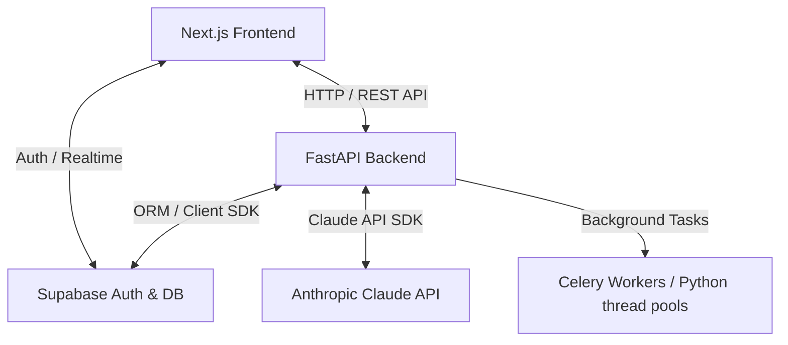

# Kozker Recruiter AI

Kozker Recruiter AI is an enterprise-grade, data-dense, AI-powered internal recruitment management platform. It automates and streamlines the full hiring lifecycle—from client mandate registration and AI-generated job openings, to candidate resume parsing, intelligent fuzzy-score matching, personalized screening question generation, and candidate pipeline tracking.

---

## Architecture and Tech Stack

The platform is split into a Next.js frontend and a FastAPI backend, utilizing Supabase for database, authentication, and file storage.

### Technology Blueprint



### 1. Frontend (/frontend)
*   **Framework**: Next.js 16 (App Router) with React 19
*   **Language**: TypeScript 5.x for robust, compile-time safety
*   **Styling**: Tailwind CSS 4.x following the DESIGN.md specification (Brand Orange `#FF6E30`, sharp corners, data-dense layouts, minimal rounded borders)
*   **Component Library**: Lucide React icons
*   **Uploader Integration**: PapaParse (CSV processing) and custom PDF/DOCX previewers
*   **API Layer**: Centered in `frontend/lib/api.ts`, featuring a dual-mode client:
    1.  **Direct Backend Integration**: Dispatches authenticated HTTP requests using the user's Supabase JWT.
    2.  **Stateful Mock Fallback**: In case the FastAPI backend is offline, the client transparently routes operations to an in-memory, stateful `MockDatabase` layer to keep the UI fully interactive and testable.

### 2. Backend (/backend)
*   **Framework**: FastAPI 0.110+ (Python 3.11+) for high-performance, asynchronous endpoints
*   **Database ORM**: Supabase Python SDK (PostgREST client)
*   **AI Engine**: Anthropic Claude API (`claude-3-5-sonnet-20241022`) for intelligent context parsing and text generation
*   **Parser Libs**: `pdfplumber` (for PDF text extraction) and `python-docx` (for Word documents)
*   **Background Jobs**: Background task execution (FastAPI `BackgroundTasks`) for long-running AI generations

---

## Key Features and Implementation Details

### 1. Requirements and AI Job Generation
*   **Implementation**: A recruiter uploads a hiring mandate (either structured fields or raw description paragraph) via the **Clients and Mandates** view.
*   **AI Integration**: Saving a requirement triggers a background task calling Anthropic's Claude. Claude generates tailored job drafts (title, overview, responsibilities, qualifications, target salary, and keywords) based on the post count requested (1-3 drafts).
*   **Notion-Style UI**: Drafts are populated in real-time in a Notion-style grouped table under `frontend/components/JobsView.tsx`, where the recruiter can manually edit, confirm, or enter custom prompts to regenerate drafts.

### 2. Requirement Management (Search, Filter, Edit, Status)
*   **Search**: Full-text search across requirement titles, descriptions, and skills.
*   **Filter**: Dropdown filter by requirement status (Draft, Generating, Ready, Archived).
*   **Inline Status Updates**: Each requirement card has a color-coded status dropdown that immediately updates the requirement status via PUT API.
*   **Edit Modal**: Pre-filled edit modal for modifying all requirement fields including title, description, skills, experience range, budget range, seniority, notes, and status.
*   **Statuses**: Requirement lifecycle follows: `draft` -> `generating` -> `ready` -> `archived`.

### 3. Scan and Publish (Weighted Skill Matching)
*   **Implementation**: Before matching candidates, the recruiter triggers **Scan and Publish**. The AI extracts five high-priority skills from the job description.
*   **Pop-up Review**: The recruiter reviews these skills in an editable modal, modifying their relative weight distributions.
*   **Fuzzy-Scoring Matcher**: The backend compares candidate profiles against the finalized weighted skill set. It computes a custom **Fuzzy Match Score (0-100)** and logs detailed matching reason analyses, saving results in the `job_candidates` and `applications` tables.

### 4. Sourcing Pool and Resume Parsers
*   **Implementation**: Recruiters can upload candidates globally on the **Sourcing Pool** view, or link them directly to a specific opening.
*   **Manual Entry**: Add individual candidates with name, email, phone, skills, experience, and raw resume text.
*   **Bulk CSV Import**: Upload a CSV file (columns: `full_name`, `email`, `phone`, `skills`, `experience_years`) via the `/api/v1/candidates/upload/csv` endpoint. Duplicates are automatically skipped by email.
*   **Parsers**: The backend uses `pdfplumber` and `python-docx` to extract text. This text is sent to Claude to isolate structured entities: `full_name`, `email`, `phone`, `skills`, and `experience_years`.

### 5. Personalized Screening Questions
*   **Implementation**: When a recruiter changes a candidate's status to **Accepted**, the AI processes the candidate's custom background, experience years, and resume highlights against the job requirements.
*   **Questions**: It generates 5 personalized screening questions categorized by difficulty (Easy, Medium, Hard).
*   **Custom Questions**: Recruiters can manually add their own screening questions through the Review Workspace "Add Question" modal.
*   **AI Adjustment**: Recruiters can refine questions inline by typing custom instructions, triggering the AI editor endpoint to reformulate them.

### 6. Interview Rounds Monitoring
*   **Implementation**: Horizontal pipeline board showing candidates as rows and interview rounds (Screening, Technical, HR, Final) as columns.
*   **Filters**: Dropdown filters for Client, Requirement, Job, Round, and Top N candidates.
*   **Stage Tracking**: Visual status indicators for each candidate at each stage (pending, passed, failed, on-hold).

### 7. Context-Aware Chatbot Copilot
*   **Implementation**: Collapsible panel in `frontend/components/ChatbotPanel.tsx` accessible on any page, also toggleable from the floating orange button and sidebar AI Copilot button.
*   **Context Passing**: Sends the recruiter's current page location (e.g., `/jobs`, `/clients`) along with database statistics (total counts of clients, jobs, requirements, candidates) to the Claude API. This allows the companion chatbot to answer complex structural queries about current pipelines and suggest candidates.

### 8. Interactive Onboarding Walkthrough
*   **Welcome Page**: First-time users are redirected to a branded welcome screen with options to start an interactive tour or explore independently.
*   **Guided Tour**: 12-step interactive walkthrough with highlighted UI targets, route transitions, and progress tracking via localStorage.
*   **Resume Banner**: Dismissed tours show a floating progress banner with resume/dismiss options.

---

## Page Routes

| Route | Page | Description |
|---|---|---|
| `/` | Root | Redirects to `/dashboard` (authenticated) or `/auth/login` |
| `/auth/login` | Login | Email/password authentication via Supabase |
| `/auth/signup` | Sign Up | New account registration |
| `/auth/forgot-password` | Forgot Password | Password reset request |
| `/auth/reset-password` | Reset Password | Password reset confirmation |
| `/welcome` | Welcome | Onboarding welcome screen with tour start/skip options |
| `/dashboard` | Dashboard | Command center with pipeline stats, AI queue status, and activity feed |
| `/clients` | Clients & Mandates | Client registration, requirement creation/editing/search/filter, and status management |
| `/jobs` | Job Catalog | AI-generated job drafts, description editing, skill weight approval, candidate matching, and inline review workspace |
| `/pool` | Sourcing Pool | Candidate database with manual entry, bulk CSV import, and resume parsing |
| `/rounds` | Interview Rounds | Horizontal pipeline board with round-by-round candidate tracking and filters |
| `/settings` | Settings | Workspace and account configuration |

---

## API Routes Reference

### Clients
| Method | Endpoint | Description |
|---|---|---|
| `GET` | `/api/v1/clients` | List all active clients |
| `POST` | `/api/v1/clients` | Create a new client |
| `DELETE` | `/api/v1/clients/{id}` | Soft-delete a client |

### Requirements
| Method | Endpoint | Description |
|---|---|---|
| `GET` | `/api/v1/requirements` | List all active requirements |
| `POST` | `/api/v1/requirements` | Create requirement and trigger AI job generation |
| `PUT` | `/api/v1/requirements/{id}` | Update requirement fields and status |
| `POST` | `/api/v1/requirements/parse-file` | Extract text from uploaded PDF/DOCX/TXT |

### Job Openings
| Method | Endpoint | Description |
|---|---|---|
| `GET` | `/api/v1/jobs` | List all job openings with joined client/requirement data |
| `POST` | `/api/v1/jobs` | Create a manual job opening |
| `POST` | `/api/v1/jobs/{id}/confirm` | Confirm an AI-generated draft |
| `POST` | `/api/v1/jobs/{id}/scan-publish` | Extract skills, approve weights, and publish |
| `POST` | `/api/v1/jobs/{id}/approve-skills` | Approve weighted skills for matching |

### Candidates
| Method | Endpoint | Description |
|---|---|---|
| `GET` | `/api/v1/candidates` | List all candidates in sourcing pool |
| `POST` | `/api/v1/candidates` | Add a single candidate manually |
| `POST` | `/api/v1/candidates/upload/csv` | Bulk import candidates from CSV |

### Applications & Matching
| Method | Endpoint | Description |
|---|---|---|
| `GET` | `/api/v1/jobs/{id}/candidates` | Get matched/linked candidates for a job |
| `POST` | `/api/v1/jobs/{id}/candidates/link` | Link a candidate to a job opening |
| `GET` | `/api/v1/applications/{id}` | Get application detail with screening data |
| `POST` | `/api/v1/applications/{id}/accept` | Accept candidate and generate screening questions |
| `POST` | `/api/v1/applications/{id}/reject` | Reject a candidate application |
| `POST` | `/api/v1/applications/{id}/stage` | Advance candidate to next interview stage |
| `POST` | `/api/v1/applications/{id}/questions` | Add a custom screening question |

### Screening Questions
| Method | Endpoint | Description |
|---|---|---|
| `GET` | `/api/v1/applications/{id}/questions` | List screening questions for an application |
| `PATCH` | `/api/v1/questions/{id}` | AI-refine a screening question with custom instruction |

### AI Copilot
| Method | Endpoint | Description |
|---|---|---|
| `POST` | `/api/v1/chat` | Send a message to the AI copilot with page context |

### System
| Method | Endpoint | Description |
|---|---|---|
| `GET` | `/` | Health check / server status |
| `GET` | `/api/v1/activity` | Get recent activity log entries |

---

## Environment Configuration

To run the application, configure your local environment files for the backend and frontend. Do not expose actual credentials or values in public environments.

### Backend Configuration (backend/.env)
Create a `.env` file in the `backend/` directory defining:
*   `SUPABASE_URL`: URL of the Supabase instance.
*   `SUPABASE_KEY`: API service key or publishable key for Supabase database operations.
*   `ANTHROPIC_API_KEY`: API key for Anthropic Claude SDK.

### Frontend Configuration (frontend/.env)
Create a `.env` file in the `frontend/` directory defining:
*   `NEXT_PUBLIC_SUPABASE_URL`: Public URL of the Supabase instance.
*   `NEXT_PUBLIC_SUPABASE_ANON_KEY`: Anonymous public key for Supabase client.
*   `NEXT_PUBLIC_SUPABASE_PUBLISHABLE_KEY`: Publishable key for Supabase client.

---

## Getting Started

### Prerequisites
*   Node.js 18+ and npm
*   Python 3.11+ and pip

### Backend Setup
1. Navigate to the backend folder:
   ```bash
   cd backend
   ```
2. Create and activate a virtual environment:
   ```bash
   python3 -m venv venv
   source venv/bin/activate
   ```
3. Install dependencies:
   ```bash
   pip install -r requirements.txt
   ```
4. Start the FastAPI development server:
   ```bash
   python main.py
   ```
   The backend will run at `http://localhost:8000`.

### Frontend Setup
1. Navigate to the frontend folder:
   ```bash
   cd frontend
   ```
2. Install dependencies:
   ```bash
   npm install
   ```
3. Run the development server:
   ```bash
   npm run dev
   ```
   Open `http://localhost:3000` in your web browser to access the Kozker Recruiter dashboard.

